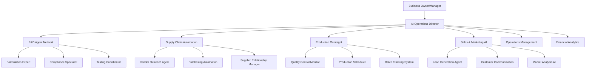
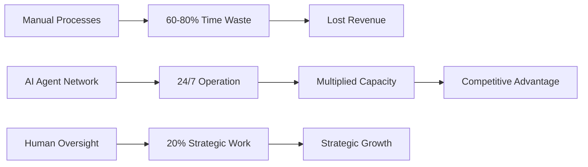

# AI Corporate Psychology
## The Future of Business Organization

**The Revolutionary Question:** What if you had 100 perfectly untrained employees ready to learn? How would you train and organize them for maximum effectiveness?

Now imagine those employees are AI agents - tireless, consistent, and capable of handling 80% of routine business tasks that consume your team's valuable time.

## The Corporate Psychology Framework

### Traditional Corporate Challenges
**Manufacturing Cosmetics Business - Department Structure:**
- **R&D/Formulation** - Product development and testing
- **Supply Chain** - Vendor relationships and procurement  
- **Production** - Manufacturing and quality control
- **Sales & Marketing** - Customer acquisition and retention
- **Operations** - Inventory, logistics, and fulfillment
- **Finance** - Accounting, budgeting, and financial planning
- **HR** - Hiring, training, and team dynamics

**The Human Problem:**
- Personality conflicts and team dynamics
- Training bottlenecks and knowledge transfer delays
- Inconsistent execution and human error
- Communication gaps between departments
- Resource allocation and priority conflicts

### The AI Solution: Organized Agent Workforce

## Strategic Implementation: The Phased Approach

### Phase 1: Critical Operations (Weeks 1-4)
**Start with high-impact, rule-based positions:**
- **Financial Operations Agent** - Automated bookkeeping, expense tracking
- **Inventory Management Agent** - Stock monitoring, reorder automation
- **Customer Service Agent** - Initial inquiry handling, order status

### Phase 2: Relationship & Communication (Weeks 5-8)
**Add personality-driven agents with specialized expertise:**
- **Vendor Relationship Manager** - Negotiation protocols, supplier communication
- **Sales Support Specialist** - Lead qualification, proposal generation
- **Quality Assurance Overseer** - Compliance monitoring, testing protocols

### Phase 3: Strategic & Creative (Weeks 9-12)
**Deploy high-level decision-making agents:**
- **Business Intelligence Analyst** - Market trends, competitive analysis
- **Product Development Coordinator** - Innovation pipeline management
- **Strategic Planning Assistant** - Growth planning, resource allocation

## The Personality & Expertise Matrix

**Why AI Agent Personalities Matter:**
- **Dialectic Growth** - Different perspectives drive better solutions
- **Specialized Expertise** - Domain-focused knowledge and decision-making
- **Consistent Performance** - No mood swings, always professional
- **Scalable Training** - One training session, infinite deployment

**Agent Personality Archetypes:**
- **The Analyst** - Data-driven, methodical, risk-averse (Finance, Compliance)
- **The Relationship Builder** - Communication-focused, empathetic (Sales, Vendor Relations)
- **The Problem Solver** - Creative, adaptive, solution-oriented (R&D, Operations)
- **The Guardian** - Detail-oriented, quality-focused (QA, Production)
- **The Strategist** - Big-picture thinking, planning-oriented (Management, Growth)

## The Mathematics of AI Efficiency

**Conservative Estimates:**
- Average knowledge worker: **60-80% time** on automatable tasks
- 20-person company: **960-1280 hours/week** of automatable work
- AI agent capacity: **24/7 operation** = 168 hours/week per agent
- **ROI Calculation:** 6-8 AI agents = 20+ human equivalent capacity

**The Compound Effect:**

## Modern AI Corporate Management

**The Sole Proprietor Advantage:**
- **100-person capacity** with single-person oversight
- **Consistent execution** without personality conflicts
- **Scalable expertise** across all business functions
- **Cost efficiency** - agents cost less than entry-level employees

**Management Principles:**
1. **Clear Role Definition** - Each agent has specific responsibilities and decision boundaries
2. **Reporting Hierarchies** - Structured communication and escalation protocols  
3. **Performance Monitoring** - Real-time analytics and continuous improvement
4. **Training Protocols** - Systematic knowledge transfer and capability enhancement
5. **Integration Standards** - Seamless handoffs between agent specializations

## The Human Element

**Where Humans Remain Essential:**
- **Strategic Vision** - Long-term planning and creative direction
- **Relationship Building** - High-value client relationships and partnerships
- **Crisis Management** - Unusual situations requiring human judgment
- **Innovation Leadership** - Breakthrough thinking and market disruption
- **Ethical Oversight** - Values-based decision making and quality control

**The 20% Rule:** Humans focus on the 20% of work that drives 80% of business value while AI handles the remaining 80% of operational tasks.

## Implementation Success Factors

**Technical Requirements:**
- Robust training data and knowledge base development
- Integration with existing business systems (Monday.com, Inflow, Shopify)
- Real-time monitoring and performance analytics
- Secure communication and data handling protocols

**Organizational Change Management:**
- Gradual implementation to maintain business continuity
- Staff retraining for higher-value strategic roles
- Cultural adaptation to human-AI collaboration
- Continuous process optimization and agent improvement

---

**The Future is Now:** While corporations struggle with human management complexity, the modern entrepreneur can build an AI-powered organization that operates with the efficiency of a Fortune 500 company and the agility of a startup.

Ready to organize your AI workforce? [[contact/Consultation Process|Let's discuss your AI corporate strategy →]]

*Specializing in AI agent psychology, organizational design, business process automation, corporate efficiency optimization, and strategic AI implementation.*