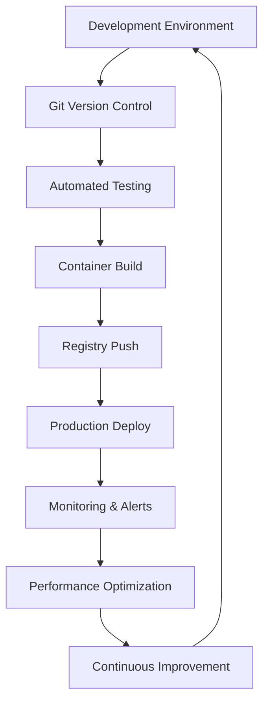
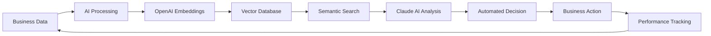

# Technology Stack & Technical Capabilities
## Comprehensive Development and Operations Expertise

Deep technical expertise across modern development stacks, infrastructure automation, and enterprise integration platforms. Specializing in manufacturing operations, business process automation, and scalable system architecture.

## Core Programming Languages & Frameworks

### Backend Development
**Node.js & TypeScript**
- Express.js API development and microservices architecture
- Real-time application development with WebSocket integration
- Database integration with PostgreSQL, SQLite, and vector databases
- Authentication and authorization system implementation

**Python Development**
- Process automation and data processing pipelines
- AI/ML model integration and deployment
- API development with FastAPI and Flask frameworks
- Scientific computing and analytics with NumPy, Pandas

**Database Systems**
- PostgreSQL for enterprise-scale relational data management
- SQLite for embedded and lightweight application data
- Vector databases for AI embeddings and semantic search
- Redis for caching and session management

### Frontend Development
**React & Next.js**
- Modern web application development with server-side rendering
- Component-based architecture and state management
- API integration and real-time data visualization
- Responsive design and mobile-first development

**TypeScript Integration**
- Type-safe development across full-stack applications
- Interface design and data model definition
- Enhanced IDE support and developer experience
- Code quality and maintainability optimization

## DevOps & Infrastructure

### Containerization & Orchestration
**Docker & Container Management**
- Application containerization and multi-service deployment
- Development environment standardization and consistency
- Production deployment and scaling optimization
- Container security and performance optimization

**Docker Compose Orchestration**
- Multi-container application deployment and coordination
- Service discovery and network configuration
- Volume management and data persistence
- Environment-specific configuration management

### CI/CD & Automation
**Git Workflow Management**
- Advanced branching strategies and merge conflict resolution
- Code review processes and quality gate implementation
- Automated testing integration and deployment pipelines
- Documentation and knowledge management systems

**Infrastructure as Code**
- Automated infrastructure provisioning and management
- Configuration management and environment standardization
- Monitoring and alerting system implementation
- Backup and disaster recovery protocol development

## Business Integration Platforms

### Monday.com Development
**Custom App Development**
- Monday Apps SDK implementation and custom application development
- Workflow automation and business process optimization
- Custom board and view creation for specialized business requirements
- Integration with external systems and data synchronization

**API Integration & Webhooks**
- GraphQL API implementation for data retrieval and manipulation
- Webhook development for real-time event processing
- Custom automation and trigger system development
- Performance optimization and rate limit management

**Manufacturing Workflow Specialization**
- Production planning and scheduling automation
- Quality control and compliance tracking systems
- Vendor management and procurement coordination
- Team collaboration and communication optimization

### Inflow Inventory Management
**API Development & Integration**
- Comprehensive Inflow API utilization and custom endpoint development
- Inventory management automation and stock optimization
- Manufacturing order coordination and batch tracking
- Vendor integration and procurement automation

**Data Management & Analytics**
- Real-time inventory tracking and reporting systems
- Custom field management and business logic implementation
- SKU optimization and product catalog organization
- Performance analytics and trend identification

**Business Process Automation**
- Automated reorder protocols and vendor coordination
- Quality control integration and compliance monitoring
- Cost tracking and profit margin analysis
- Integration with sales and fulfillment systems

### AI & Machine Learning Integration

**OpenAI & Claude AI Development**
- Custom AI agent development with specialized knowledge bases
- Embedding generation and vector search implementation
- Retrieval Augmented Generation (RAG) system architecture
- Multi-agent coordination and communication protocols

**Vector Database Implementation**
- Semantic search and knowledge retrieval systems
- Embedding storage and similarity matching optimization
- Real-time query processing and response generation
- Performance optimization and scalability planning

**Business Intelligence & Analytics**
- Custom AI agent development for business operations
- Automated decision-making and process optimization
- Performance monitoring and predictive analytics
- Integration with existing business systems and workflows

## Enterprise Tools & Platforms

### Documentation & Knowledge Management
**Quartz Static Site Generation**
- Advanced documentation system development and customization
- Knowledge base organization and search optimization
- Team collaboration and information sharing platforms
- Performance optimization and deployment automation

**Obsidian Integration**
- Personal knowledge management and note-taking system optimization
- Plugin development and workflow customization
- Team collaboration and shared knowledge base development
- Integration with business systems and documentation workflows

### Communication & Collaboration
**Slack Integration Development**
- Custom bot development and workflow automation
- Team communication optimization and notification management
- Integration with business systems and alerting protocols
- Performance monitoring and usage analytics

**Email Automation & Marketing**
- Automated email campaign development and deployment
- Customer communication and relationship management
- Integration with CRM systems and business workflows
- Performance tracking and optimization protocols

## Security & Compliance

### Application Security
**Authentication & Authorization**
- OAuth and JWT implementation for secure API access
- Multi-factor authentication and session management
- Role-based access control and permission management
- Security audit and vulnerability assessment protocols

**Data Protection & Privacy**
- GDPR and industry-specific compliance implementation
- Data encryption and secure storage protocols
- Backup and disaster recovery system development
- Security monitoring and incident response procedures

### Infrastructure Security
**Network Security & VPN Management**
- Tailscale VPN configuration and network security optimization
- Firewall configuration and intrusion detection systems
- SSL/TLS certificate management and encryption protocols
- Security monitoring and threat detection systems

**Monitoring & Alerting**
- Real-time system monitoring and performance tracking
- Automated alerting and incident response protocols
- Log management and security audit trail maintenance
- Capacity planning and resource optimization

## Development Methodology

### Agile & Scrum Implementation
**Process Optimization**
- Sprint planning and retrospective facilitation
- Backlog management and story estimation protocols
- Team collaboration and communication optimization
- Performance measurement and continuous improvement

**Quality Assurance**
- Automated testing implementation and test-driven development
- Code review processes and quality gate establishment
- Performance testing and optimization protocols
- Documentation standards and maintenance procedures

### Continuous Improvement
**Performance Monitoring**
- Real-time application monitoring and alerting systems
- Performance optimization and capacity planning
- User experience tracking and improvement recommendations
- Cost optimization and resource efficiency analysis

**Technical Innovation**
- Emerging technology evaluation and implementation planning
- Technical debt management and refactoring protocols
- Architecture evolution and scalability enhancement
- Team training and capability development programs

---

## Technology Integration Philosophy

**Business-First Approach**
- Technology selection based on business value and ROI optimization
- User experience prioritization and adoption facilitation
- Scalability planning and growth accommodation
- Cost-effectiveness and resource optimization

**Cultural Integration**
- Team training and technology adoption facilitation
- Change management and stakeholder engagement
- Knowledge transfer and documentation standards
- Continuous learning and capability development

Ready to leverage cutting-edge technology for your business transformation? [[contact/Consultation Process|Let's discuss your technical requirements →]]

*Specializing in manufacturing technology integration, business process automation, AI development, DevOps implementation, and enterprise system optimization.*