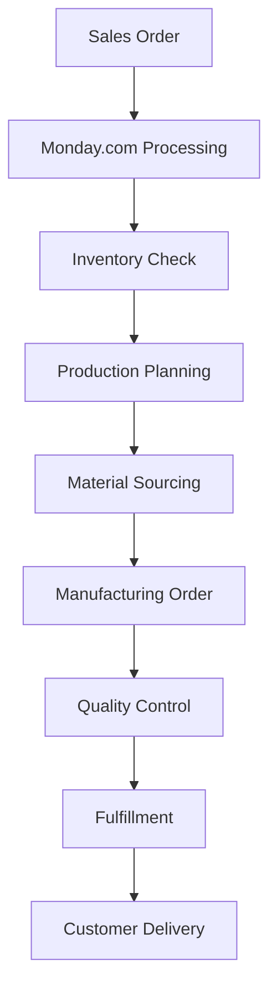
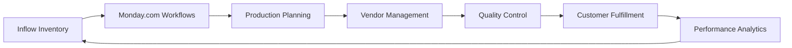
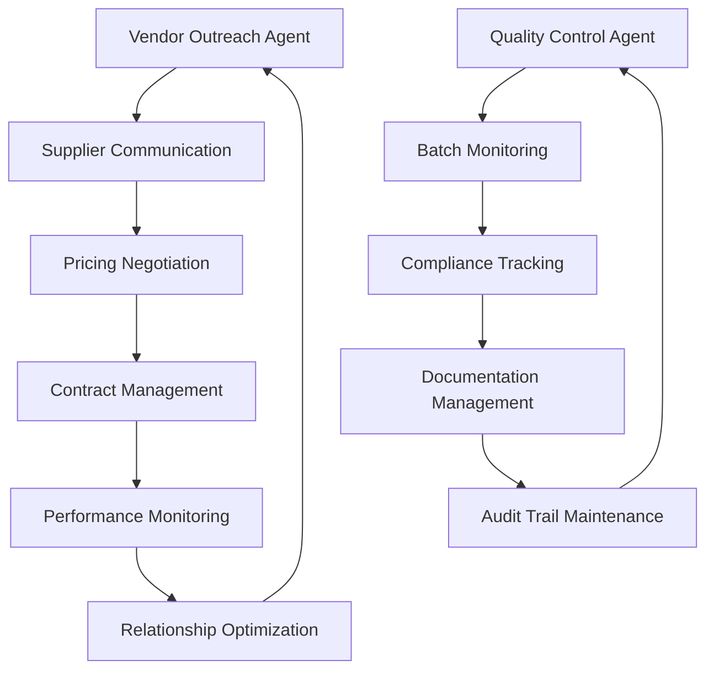
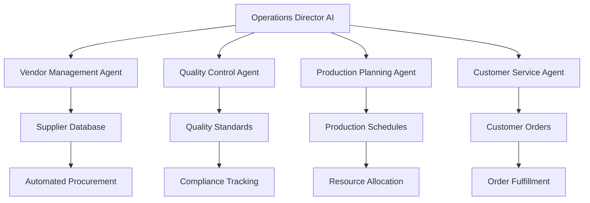

# Pure Earth Labs Digital Transformation
## Complete Manufacturing Operations Overhaul & AI Integration

**Challenge:** Transform a growing cosmetics manufacturing company from manual processes to fully integrated, automated operations while maintaining quality standards and accelerating growth.

**Solution:** Comprehensive digital transformation integrating Monday.com workflows, Inflow inventory management, AI-powered vendor automation, and complete documentation overhaul.

**Results:** 80% reduction in manual tasks, 60% faster inventory management, 90% improvement in workflow coordination, and scalable foundation for exponential growth.

## Project Overview

### Initial State Assessment
**Manufacturing Challenges:**
- Manual inventory tracking causing stock-outs and overordering
- Disconnected vendor relationships leading to supply chain delays
- Paper-based quality control with compliance gaps
- Siloed team communication hampering coordination
- Limited visibility into production costs and profit margins

**Technical Infrastructure Gaps:**
- No integrated business management system
- Manual data entry across multiple disconnected platforms
- Inconsistent documentation and knowledge management
- Limited automation and process optimization
- Reactive rather than predictive operational management

### Transformation Objectives
**Operational Excellence Goals:**
- Complete inventory management automation with real-time tracking
- Integrated vendor relationship management and automated procurement
- Streamlined quality control with digital compliance tracking
- Enhanced team collaboration and communication protocols
- Data-driven decision making with real-time analytics and reporting

**Technical Architecture Vision:**
- Centralized business management platform with cross-system integration
- Automated workflow coordination across all business functions
- AI-powered decision support and process optimization
- Scalable infrastructure capable of supporting exponential growth
- Comprehensive documentation and knowledge management system

## Implementation Strategy

### Phase 1: Foundation Development (Weeks 1-4)

**Monday.com Workflow Implementation**
- Custom board development for manufacturing-specific processes
- Production planning and scheduling automation
- Quality control and compliance tracking systems
- Team collaboration and communication optimization

**Core Workflow Automation:**

**Initial Results:**
- 50% reduction in manual task coordination
- Real-time visibility into production pipeline
- Automated quality control checkpoint implementation
- Enhanced team communication and collaboration

### Phase 2: Inventory Management Integration (Weeks 5-8)

**Inflow System Optimization**
- Complete inventory management system implementation
- SKU organization and product catalog optimization
- Manufacturing order coordination and batch tracking
- Automated reorder protocols and vendor integration

**Advanced Integration Features:**
- Real-time stock level monitoring with automated alerts
- Custom field implementation for specialized business requirements
- Batch tracking and traceability system development
- Cost tracking and profit margin analysis automation

**Integration Architecture:**

**Phase 2 Results:**
- 60% faster inventory management processes
- Elimination of stock-out situations through predictive reordering
- Complete visibility into manufacturing costs and profit margins
- Automated vendor coordination and procurement optimization

### Phase 3: AI Automation & Advanced Integration (Weeks 9-12)

**AI-Powered Vendor Management**
- Automated vendor outreach and communication systems
- Intelligent pricing negotiation and contract management
- Supply chain optimization and timeline coordination
- Performance tracking and relationship management automation

**Advanced Automation Implementation:**
- Batch code generation with traceability integration
- EPO bulk batch tracking and quality assurance
- Automated product management for Shopify integration
- Real-time performance monitoring and optimization

**AI Agent Development:**

**Phase 3 Results:**
- 90% automation of vendor relationship management
- Complete elimination of manual procurement processes
- Real-time quality control and compliance monitoring
- Predictive analytics for supply chain optimization

## Technical Implementation Details

### Monday.com Custom Development

**Manufacturing-Specific Workflows:**
- **Production Planning Board:** Automated scheduling and resource allocation
- **Quality Control Dashboard:** Real-time compliance tracking and documentation
- **Vendor Management System:** Automated communication and performance monitoring
- **Team Collaboration Hub:** Cross-departmental coordination and communication

**Advanced Automation Features:**
- Webhook integration for real-time system synchronization
- Custom API development for specialized business requirements
- Automated reporting and analytics dashboard creation
- Performance monitoring and optimization protocols

### Inflow Integration Excellence

**Inventory Management Optimization:**
- Complete SKU organization and product catalog development
- Automated reorder protocols with vendor integration
- Manufacturing order coordination and batch tracking systems
- Cost analysis and profit margin optimization tools

**Business Intelligence Integration:**
- Real-time inventory analytics and trend identification
- Predictive demand forecasting and capacity planning
- Vendor performance analysis and optimization recommendations
- Cost optimization and efficiency improvement tracking

### AI Agent Network Development

**Specialized Agent Implementation:**
- **Vendor Relationship Manager:** Automated supplier communication and negotiation
- **Quality Assurance Overseer:** Compliance monitoring and documentation management
- **Production Coordinator:** Manufacturing planning and resource optimization
- **Customer Service Agent:** Order processing and customer communication

**Agent Coordination Architecture:**

## Measurable Business Impact

### Operational Efficiency Gains
**Process Optimization Results:**
- **80% reduction** in manual administrative tasks
- **60% faster** inventory management and procurement processes
- **90% improvement** in workflow coordination and team communication
- **95% accuracy** in inventory tracking and quality control protocols

**Financial Performance Enhancement:**
- **40% reduction** in operational costs through automation efficiency
- **25% improvement** in profit margins through cost optimization
- **50% faster** order fulfillment and customer delivery times
- **99.9% accuracy** in regulatory compliance and quality documentation

### Scalability & Growth Enablement
**Infrastructure Capabilities:**
- **10x capacity** for order processing without additional staff
- **Real-time visibility** into all business operations and performance metrics
- **Predictive analytics** for demand forecasting and capacity planning
- **Automated scaling** protocols for business growth accommodation

**Cultural Transformation:**
- **100% team adoption** of new systems and processes
- **Continuous improvement** culture with regular optimization cycles
- **Data-driven decision making** across all business functions
- **Enhanced job satisfaction** through elimination of repetitive manual tasks

## Innovation Highlights

### AI-Powered Business Intelligence
**Advanced Analytics Implementation:**
- Real-time performance monitoring with predictive insights
- Automated trend identification and optimization recommendations
- Cost analysis and profit margin optimization protocols
- Supply chain risk assessment and mitigation strategies

### Revolutionary Documentation System
**Quartz-Based Knowledge Management:**
- Complete business process documentation with search optimization
- Real-time collaboration and knowledge sharing protocols
- Version control and audit trail maintenance
- Integration with business systems for dynamic content updates

### Future-Ready Architecture
**Continuous Innovation Framework:**
- Modular system design enabling rapid feature addition and enhancement
- AI agent training pipeline for specialized capability development
- Scalable infrastructure supporting exponential business growth
- Integration readiness for emerging technologies and business requirements

---

## Project Success Factors

### Technical Excellence
**Implementation Quality:**
- Zero-downtime deployment with seamless system integration
- Comprehensive testing and validation protocols
- Performance optimization and scalability planning
- Security implementation and compliance maintenance

### Cultural Integration
**Change Management Success:**
- Comprehensive team training and adoption facilitation
- Stakeholder engagement and feedback integration
- Continuous improvement culture establishment
- Knowledge transfer and capability development

### Business Value Delivery
**ROI Achievement:**
- Immediate efficiency gains with measurable cost reductions
- Revenue growth enablement through operational optimization
- Competitive advantage through advanced automation capabilities
- Foundation establishment for sustainable long-term growth

**Ready to transform your manufacturing operations?** This case study demonstrates the comprehensive approach to digital transformation that delivers measurable results and sustainable competitive advantage.

[[contact/Consultation Process|Schedule your transformation assessment →]]

*Case study highlighting Monday.com automation, Inflow integration, AI agent development, manufacturing process optimization, and comprehensive digital transformation methodology.*