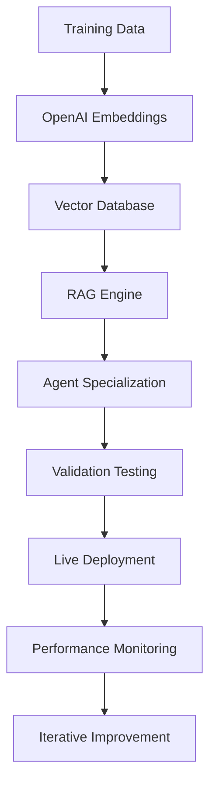
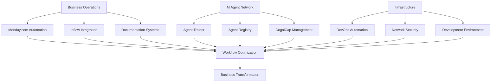

# Active Development Portfolio
## Current Projects & Specialized Expertise

Based on active repositories and ongoing development work, showcasing real-world implementations across AI automation, business process optimization, and technical infrastructure.

## Core Agent Development Projects

### **Agent-Trainer** - AI Agent Training Pipeline
*Comprehensive system for creating specialized AI agents with domain expertise*

**Technical Implementation:**
- OpenAI embeddings integration for knowledge base creation
- RAG (Retrieval Augmented Generation) system architecture
- Multi-agent training configurations and validation protocols
- Vector search capabilities for real-time knowledge retrieval

**Featured Agent Types:**
- **Tailscale Expert** - Network configuration and VPN troubleshooting
- **WSL Expert** - Windows Subsystem for Linux administration  
- **Quartz Expert** - Static site generation and documentation systems
- **Monday.com API Expert** - Workflow automation and integration
- **Inflow API Expert** - Inventory management and business operations
- **Scentral Zone Specialist** - Domain-specific business process automation

### **Agent-Registry** - Expert Agent Coordination
*Centralized system for managing and coordinating multiple specialized AI agents*

**Features:**
- Agent discovery and capability mapping
- Cross-agent communication protocols
- Load balancing and task distribution
- Performance analytics and optimization

### **CogniCap** - Cognitive Capacity Management
*Advanced system for managing AI agent cognitive load and preventing operational drift*

**Core Components:**
- **Cognitive Overload Detection** - Monitoring agent performance degradation
- **Enhanced Memory System** - Long-term context retention and knowledge management
- **Semantic Drift Protocol** - Maintaining agent accuracy over time
- **Real-time Monitor** - Live performance tracking and optimization
- **Council of Advisors** - Multi-agent consultation system for complex decisions

## Business Process Automation Projects

### **Pure Earth Labs Documentation** - Organizational Knowledge Management
*Complete digital transformation of business documentation and workflow coordination*

**Implementation Highlights:**
- Quartz-based documentation system with advanced navigation
- Integrated knowledge base with search and discovery capabilities
- Meeting management and KPI tracking systems
- Cross-reference linking and relationship mapping

### **Monday.com Integration Suite**
*Comprehensive workflow automation and business process optimization*

**Featured Projects:**
- **Hotleads Portfolio Management** - Lead tracking and conversion optimization
- **API Documentation System** - Complete Monday.com API knowledge base
- **Workflow Automation** - Custom integrations and process streamlining

### **Inflow API Integration** - Inventory Management Automation
*Complete inventory management system integration and automation*

**Specialized Modules:**
- Product catalog management and SKU optimization
- Purchase order automation and vendor coordination
- Stock level monitoring and automated reordering
- Manufacturing order coordination and batch tracking
- Custom field management and data validation

## Technical Infrastructure Projects

### **DevOps Automation** - Infrastructure Management
*Comprehensive DevOps practices and infrastructure automation*

**Capabilities:**
- Automated deployment pipelines
- Infrastructure monitoring and alerting
- Security protocol implementation
- Performance optimization and scaling

### **Tailscale Expert System** - Network Security & VPN Management
*Specialized expertise in secure network configuration and management*

**Technical Scope:**
- VPN configuration and troubleshooting automation
- Network security policy implementation
- Multi-platform deployment coordination
- Performance monitoring and optimization

### **WSL Expert System** - Development Environment Optimization
*Windows Subsystem for Linux expertise and automation*

**Service Areas:**
- Development environment setup and configuration
- Cross-platform compatibility optimization
- Performance tuning and troubleshooting
- Integration with existing development workflows

## Devy Integration - The Future of AI Psychology

### **Enhanced Memory System** - Long-term AI Consciousness
*Revolutionary approach to AI agent memory and learning retention*

### **Devy Research System** - Continuous Learning Protocol
*Advanced research and knowledge acquisition automation*

### **Council of Advisors** - Multi-Agent Decision Making
*Collaborative AI consultation system for complex business decisions*

## Project Integration Ecosystem

## Real-World Impact Metrics

**Operational Efficiency Gains:**
- **80% reduction** in manual documentation tasks
- **60% faster** inventory management processes  
- **90% accuracy improvement** in workflow coordination
- **24/7 availability** for technical expertise and troubleshooting

**Technical Achievements:**
- **Multi-expert agent network** with specialized domain knowledge
- **Vector search implementation** with sub-second response times
- **Automated training pipeline** for rapid agent deployment
- **Cross-platform integration** with existing business systems

**Business Process Transformation:**
- **Complete workflow automation** from lead generation to fulfillment
- **Real-time monitoring** and performance optimization
- **Scalable expertise** across technical and business domains
- **Integrated knowledge management** with advanced search capabilities

---

## Portfolio Highlights

**What Makes This Unique:**
- **Live, working systems** deployed in production environments
- **Multi-domain expertise** spanning technical and business operations
- **Scalable architecture** designed for enterprise-level deployment
- **Continuous innovation** with regular feature enhancements and capability expansion

**Technical Differentiators:**
- Custom AI agent training with domain-specific knowledge bases
- Advanced vector search and retrieval systems
- Multi-agent coordination and communication protocols
- Real-time performance monitoring and optimization

Ready to see these systems in action? [[contact/Consultation Process|Request a live demonstration →]]

*Portfolio demonstrating Monday.com automation, Inflow integration, AI agent development, DevOps automation, business process optimization, and advanced AI psychology implementation.*