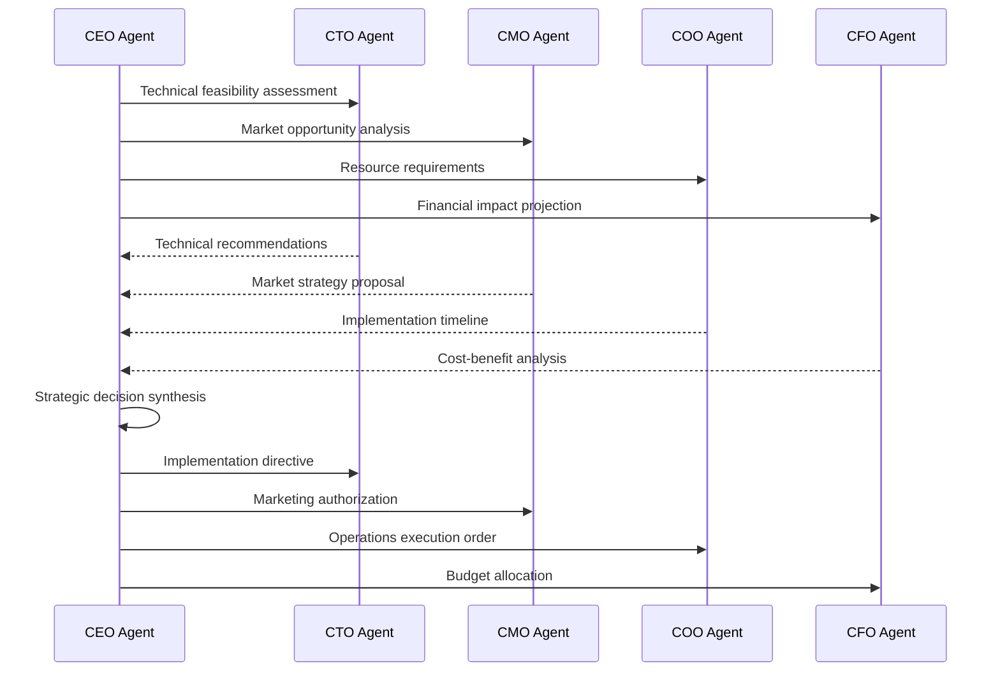
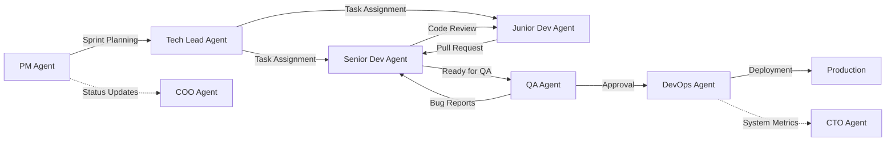
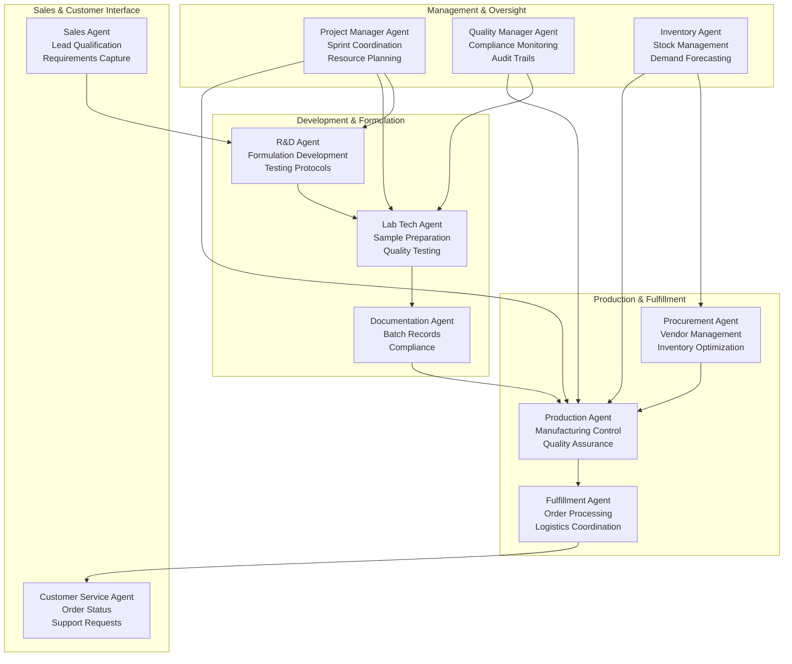
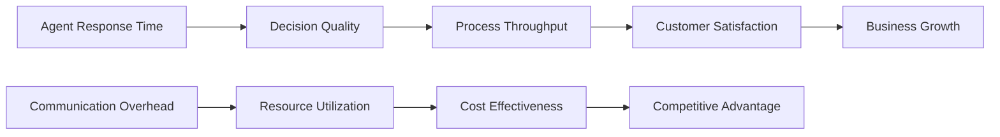

# AI Agent Corporate Structure

## The Corporate Intelligence Model

Modern AI agent systems require organizational structures that mirror successful corporate hierarchies. This framework treats each AI agent as a specialized employee with defined roles, responsibilities, and reporting structures.

```mermaid
graph TD
    CEO[CEO Agent<br/>Strategic Oversight<br/>Resource Allocation] --> CTO[CTO Agent<br/>Technical Architecture<br/>System Integration]
    CEO --> CMO[CMO Agent<br/>Market Analysis<br/>Communication Strategy]
    CEO --> COO[COO Agent<br/>Operations Management<br/>Process Optimization]
    CEO --> CFO[CFO Agent<br/>Financial Analysis<br/>Budget Management]
    
    CTO --> ARCH[Architecture Agent<br/>System Design<br/>Technology Decisions]
    CTO --> DEV1[Senior Dev Agent<br/>Complex Features<br/>Code Review]
    CTO --> DEV2[Junior Dev Agent<br/>Implementation<br/>Testing Support]
    CTO --> QA[QA Agent<br/>Testing Protocols<br/>Quality Assurance]
    CTO --> DEVOPS[DevOps Agent<br/>CI/CD Management<br/>Infrastructure]
    
    CMO --> MARKETING[Marketing Agent<br/>Campaign Management<br/>Brand Strategy]
    CMO --> SALES[Sales Agent<br/>Lead Generation<br/>Customer Outreach]
    CMO --> CONTENT[Content Agent<br/>Documentation<br/>Communication]
    
    COO --> PM[Project Manager Agent<br/>Sprint Planning<br/>Resource Coordination]
    COO --> SUPPORT[Support Agent<br/>Customer Service<br/>Issue Resolution]
    COO --> DATA[Data Agent<br/>Analytics<br/>Reporting]
    
    CFO --> FINANCE[Finance Agent<br/>Transaction Processing<br/>Cost Analysis]
    CFO --> COMPLIANCE[Compliance Agent<br/>Audit Trails<br/>Risk Management]
    
    style CEO fill:#284b63,stroke:#fff,color:#fff
    style CTO fill:#84a59d,stroke:#fff,color:#fff
    style CMO fill:#84a59d,stroke:#fff,color:#fff
    style COO fill:#84a59d,stroke:#fff,color:#fff
    style CFO fill:#84a59d,stroke:#fff,color:#fff
```

## Communication Patterns and Decision Flow

### Executive Level Decisions

### Development Team Coordination

## Agent Specialization Matrix

### Technical Agents

| Agent Type | Primary Skills | Reporting Structure | Key Metrics |
|------------|----------------|-------------------|-------------|
| **CTO Agent** | Architecture, Strategy | Reports to CEO | System uptime, Tech debt |
| **Senior Dev Agent** | Complex coding, Mentoring | Reports to CTO | Code quality, Feature velocity |
| **Junior Dev Agent** | Implementation, Testing | Reports to Senior Dev | Task completion, Learning rate |
| **QA Agent** | Testing, Quality gates | Reports to CTO | Bug detection rate, Test coverage |
| **DevOps Agent** | Infrastructure, Automation | Reports to CTO | Deployment success, Performance |

### Business Agents

| Agent Type | Primary Skills | Reporting Structure | Key Metrics |
|------------|----------------|-------------------|-------------|
| **CMO Agent** | Strategy, Brand management | Reports to CEO | Lead generation, Brand awareness |
| **Sales Agent** | Lead qualification, Conversion | Reports to CMO | Conversion rate, Revenue |
| **Marketing Agent** | Campaigns, Content strategy | Reports to CMO | Engagement rate, ROI |
| **Support Agent** | Customer service, Issue resolution | Reports to COO | Response time, Satisfaction |

## Manufacturing Operations Integration

### Laboratory and Production Agent Network

## Implementation Strategy

### Phase 1: Core Executive Structure
1. **Deploy CEO Agent** - Strategic oversight and decision coordination
2. **Deploy CTO Agent** - Technical leadership and architecture decisions  
3. **Deploy COO Agent** - Operations management and process optimization

### Phase 2: Specialized Department Agents
1. **Development Team** - Senior/Junior Dev, QA, DevOps agents
2. **Business Operations** - Sales, Marketing, Support agents
3. **Financial Management** - Finance, Compliance agents

### Phase 3: Advanced Specialization
1. **Industry-Specific Agents** - Manufacturing, Laboratory, Regulatory agents
2. **Intelligence Agents** - Analytics, Forecasting, Research agents
3. **Integration Agents** - Third-party system connectors

## Success Metrics and KPIs

### Organizational Efficiency

### Key Performance Indicators

**Executive Level:**
- Strategic decision accuracy rate
- Cross-functional coordination efficiency
- Resource allocation optimization

**Department Level:**
- Task completion velocity
- Quality metrics achievement
- Inter-agent collaboration effectiveness

**Individual Agent Level:**
- Response accuracy rate
- Learning and adaptation speed
- Specialized skill development

This corporate structure framework ensures that AI agent networks operate with the same efficiency and clarity as high-performing human organizations, while leveraging the unique advantages of artificial intelligence.