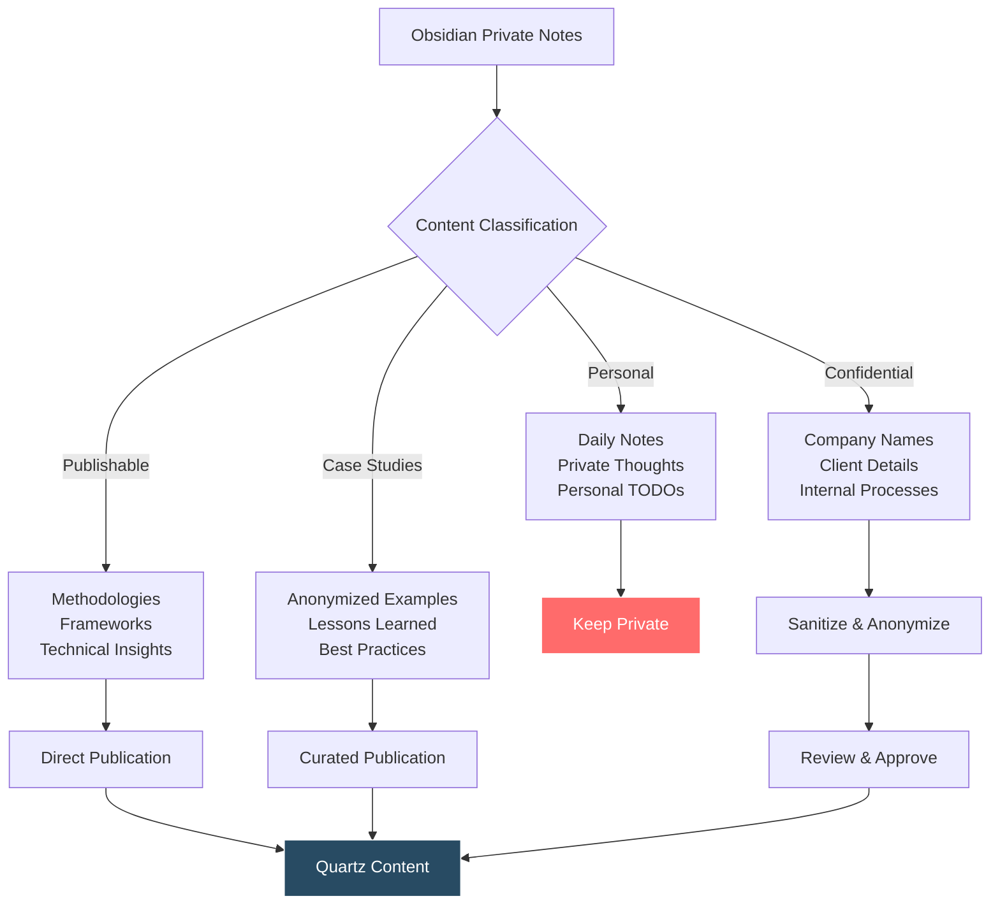
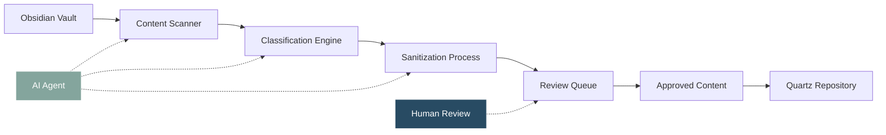
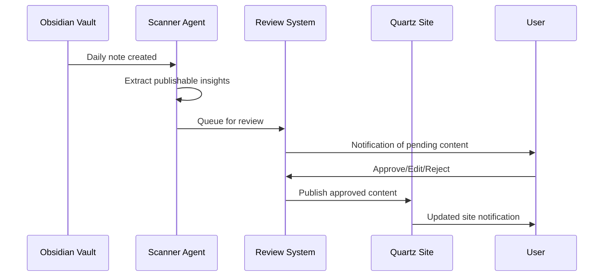
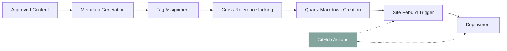

# Obsidian to Quartz Publishing Workflow

## The Knowledge Management Challenge

Organizations and individuals often maintain extensive private knowledge bases in tools like Obsidian, but struggle to selectively publish valuable insights to public platforms. This workflow bridges that gap, enabling seamless content curation from private notes to professional portfolio sites.

## Current Obsidian Structure Analysis

Based on your current repository structure:

```
private/
├── daily-notes/          # Personal reflection and planning
├── meetings/            # Leadership and project meetings
├── projects/            # Active project documentation
└── todos/              # Task management and parking lot items
```

### Content Classification Framework



## Automated Publishing Pipeline

### Phase 1: Content Extraction and Sanitization



### Sanitization Rules Engine

**Automatic Removals:**
- Personal names (replace with roles: "CEO", "Tech Lead", "QA Engineer")
- Company names (replace with industry descriptors: "Manufacturing Client", "SaaS Startup")
- Specific dollar amounts (replace with ranges: "$X-Y range")
- Internal system names (replace with generic terms: "CRM System", "Inventory Platform")

**Content Enhancement:**
- Add context for public audience
- Include relevant diagrams and visualizations
- Cross-reference related public content
- Add appropriate tags and metadata

## Publishing Workflow Implementation

### Repository Structure Integration

```
portfolio/
├── content/
│   ├── capabilities/        # Core competencies
│   ├── case-studies/       # Anonymized client work
│   ├── documentation/      # Methodology frameworks
│   ├── services/           # Service offerings
│   └── insights/          # Curated from daily notes
├── private/
│   ├── daily-notes/       # Raw thoughts and planning
│   ├── meetings/          # Internal discussions
│   └── staging/           # Pre-publication review
└── scripts/
    ├── content-scanner.py  # Automated content extraction
    ├── sanitizer.py       # Content cleaning and anonymization
    └── publisher.py       # Quartz integration
```

### Automated Content Processing



## Content Transformation Examples

### From Private Meeting Notes to Public Insights

**Private Note (meetings/KPI Themes.md):**
```markdown
# Weekly Leadership Meeting Prep

1. Development work - keeping up
   - Mari needs more support with documentation
   - Bulk and QA always have needed documentation
2. Shopify catalog and expansion
   - Work with Amber on updates
   - Samples getting onto Shopify
```

**Published Insight (insights/Manufacturing Team Coordination.md):**
```markdown
# Manufacturing Team Coordination Patterns

## Development Team Support Structure
- Technical documentation requires dedicated resources
- Quality assurance processes need continuous documentation updates
- Cross-functional collaboration essential for catalog management

## E-commerce Integration Challenges
- Product catalog synchronization between systems
- Sample management and customer-facing platforms
- Marketing and sales alignment on product updates
```

### From Daily Notes to Methodology Documentation

**Private Note (daily-notes/2025-08-06.md):**
```markdown
│ the next thing to do here is get the dev-agent a branch for this repo, 
│ then start it up on an endpoint. do the same for the pm-agent repo. 
│ then, have the pm agent look over this project and ensure it approves 
│ scope and tickets, and that work is ready for the dev agent.
```

**Published Framework (documentation/AI Agent Workflow.md):**
```markdown
## Multi-Agent Development Workflow

### Agent Coordination Pattern
1. **Project Manager Agent** reviews scope and tickets
2. **Development Agent** receives approved work items
3. **Quality Assurance Agent** validates implementation
4. **Integration Agent** manages deployment pipeline

This pattern reduces cognitive overhead through effective 
AI-agent data management and work tracking systems.
```

## Technical Implementation

### Content Scanner Configuration

```python
# content-scanner.py
class ObsidianContentScanner:
    def __init__(self, vault_path, output_path):
        self.vault_path = vault_path
        self.output_path = output_path
        self.publishable_patterns = [
            'methodology',
            'framework',
            'best practice',
            'lesson learned',
            'insight'
        ]
    
    def scan_daily_notes(self):
        # Extract insights from daily notes
        # Apply sanitization rules
        # Generate publishable content
        pass
    
    def scan_meeting_notes(self):
        # Extract methodologies and frameworks
        # Remove confidential information
        # Create anonymized case studies
        pass
```

### Quartz Integration Automation



## Quality Control Process

### Content Review Checklist

**Before Publication:**
- [ ] All personal/company names anonymized
- [ ] Specific financial data generalized
- [ ] Internal system names replaced with generic terms
- [ ] Context added for public audience
- [ ] Appropriate tags and categories assigned
- [ ] Cross-references to related content added

**Post-Publication:**
- [ ] Links functioning correctly
- [ ] Mermaid diagrams rendering properly
- [ ] SEO metadata complete
- [ ] Social sharing preview optimized

## Publishing Schedule and Automation

### Automated Daily Processing

```mermaid
gantt
    title Obsidian to Quartz Publishing Schedule
    dateFormat  HH:mm
    
    section Daily Processing
    Scan new notes           :active, scan, 08:00, 1h
    Content classification   :classify, after scan, 30m
    Sanitization process     :sanitize, after classify, 1h
    Review queue update      :queue, after sanitize, 15m
    
    section Weekly Publishing
    Content review           :review, mon, 2h
    Batch publication        :publish, after review, 1h
    Site rebuild             :rebuild, after publish, 30m
    Quality check            :qc, after rebuild, 1h
    
    section Monthly Optimization
    Analytics review         :analytics, 1st, 2h
    Content gap analysis     :gaps, after analytics, 1h
    Workflow refinement      :refine, after gaps, 2h
```

## Success Metrics

### Content Production Metrics
- **Daily notes processed:** Target 5-10 insights/week
- **Meeting notes converted:** Target 2-3 methodologies/month  
- **Publishing efficiency:** <2 hours from note to publication
- **Content quality:** >90% approval rate in review process

### Audience Engagement Metrics
- **Page views on published insights**
- **Time spent on methodology pages**
- **Cross-references clicked**
- **Social sharing of anonymized case studies**

This workflow enables continuous knowledge capture and publication while maintaining privacy, professionalism, and valuable insight sharing.