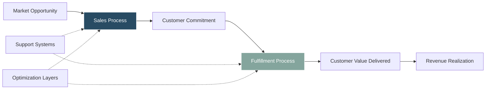
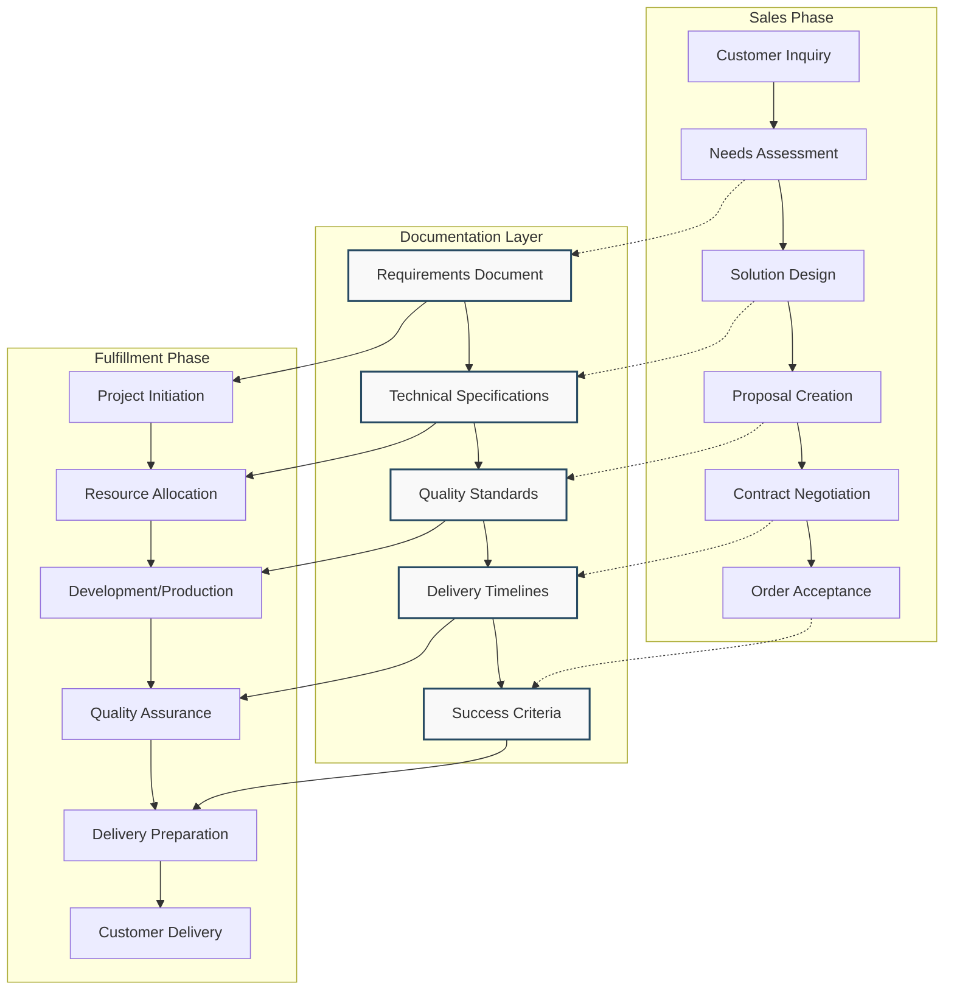
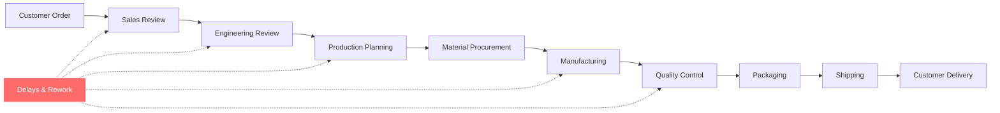
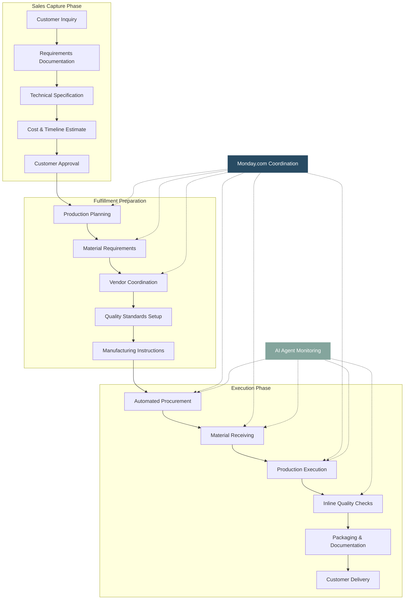
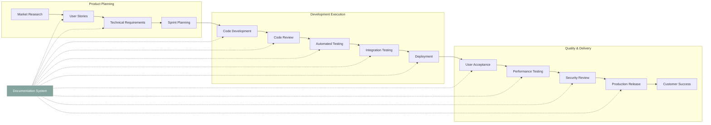
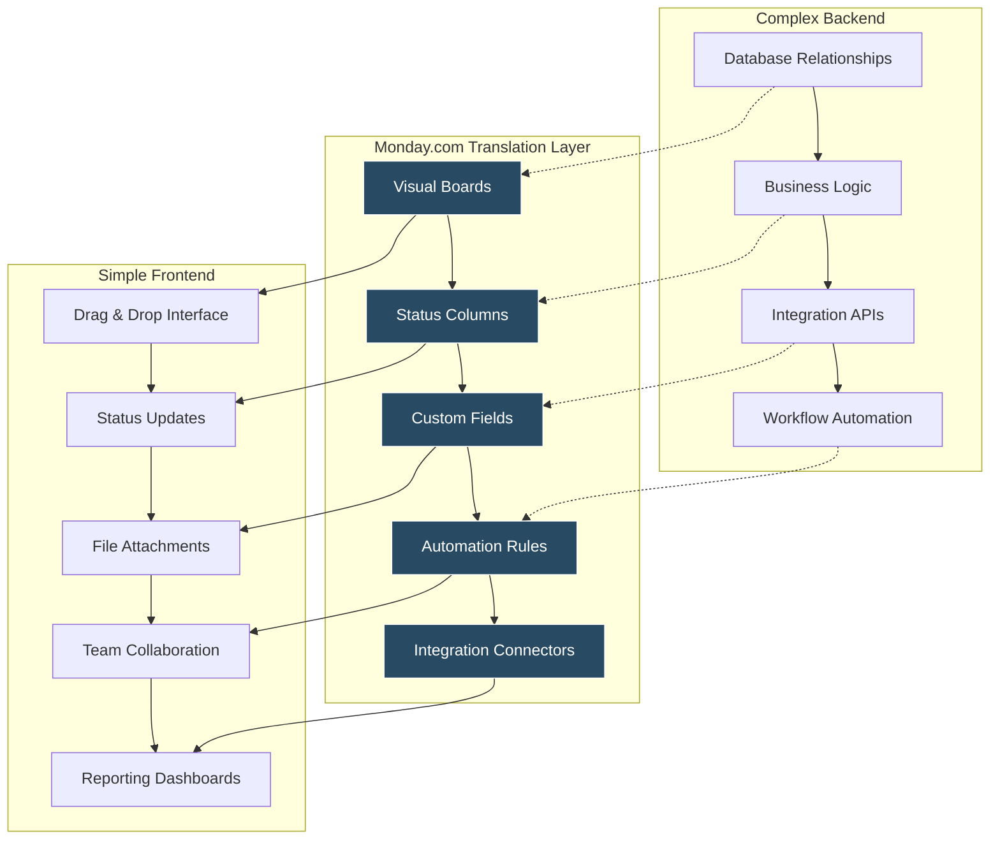
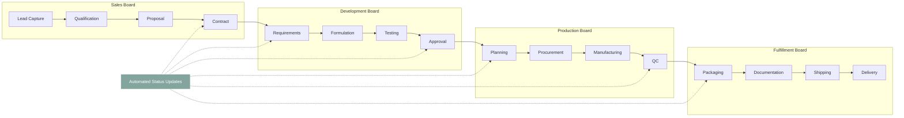
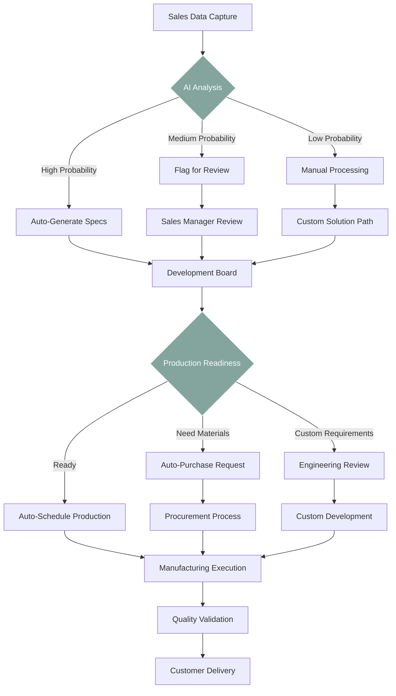
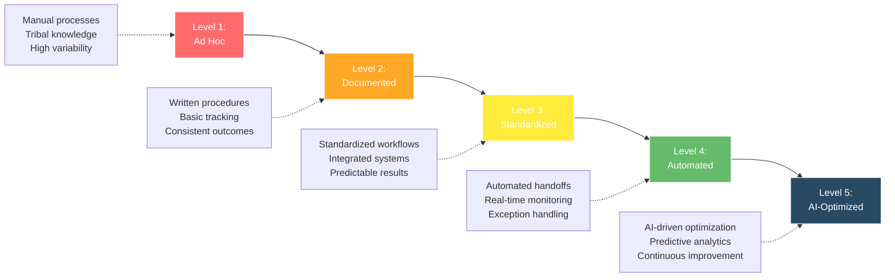

# Value Stream Optimization: From Sales to Fulfillment

## The Fundamental Business Truth

**All business activity ultimately reduces to two core functions: Sales and Fulfillment.** Everything else is overhead, optimization, or support for these primary value-creating activities.

## The Documentation Bridge Model

Documentation serves as the critical information bridge that transforms sales promises into fulfillment reality. Without effective documentation, organizations experience:

- **Information Loss** between sales and delivery teams
- **Quality Variations** due to unclear specifications
- **Customer Dissatisfaction** from unmet expectations
- **Operational Inefficiencies** from repeated clarifications

### Information Flow Architecture

## Manufacturing Value Stream Example

### Traditional Manufacturing Flow (Pre-Documentation Optimization)

**Problems with Traditional Flow:**
- Multiple handoff delays
- Information loss at transitions
- Frequent rework cycles
- Quality issues discovered late

### Optimized Manufacturing Value Stream (Documentation-Driven)

## Software Development Value Stream

### Agile Development with Documentation Integration

## Platform Integration Strategy: The Monday.com Advantage

Monday.com succeeds as a value stream optimization platform because it bridges the gap between complex data management and simple user interfaces.

### Why Monday.com Works for Value Stream Optimization

### Monday.com in Manufacturing Operations

**Sales Board → Development Board → Production Board → Fulfillment Board**

## AI-Enhanced Value Stream Intelligence

### Intelligent Automation Points

## Measuring Value Stream Efficiency

### Key Performance Indicators

**Lead Time Metrics:**
- Sales cycle duration
- Development cycle time
- Production cycle time
- Total customer cycle time

**Quality Metrics:**
- First-pass yield rate
- Customer satisfaction scores
- Rework frequency
- Compliance adherence

**Efficiency Metrics:**
- Resource utilization rates
- Automation percentage
- Documentation completeness
- Cross-functional handoff time

### Value Stream Maturity Model

## Implementation Roadmap

### Phase 1: Documentation Foundation (0-3 months)
1. Map current value streams
2. Identify documentation gaps
3. Implement basic tracking systems
4. Train teams on documentation standards

### Phase 2: Platform Integration (3-6 months)
1. Deploy Monday.com or equivalent platform
2. Create standardized board templates
3. Integrate with existing systems
4. Establish automated status updates

### Phase 3: Advanced Automation (6-12 months)
1. Implement AI-driven process optimization
2. Deploy intelligent agents for routine tasks
3. Create predictive analytics dashboards
4. Establish continuous improvement loops

**Result:** Organizations achieve 40-60% reduction in cycle times, 30-50% improvement in quality metrics, and 25-35% increase in customer satisfaction scores through systematic value stream optimization.