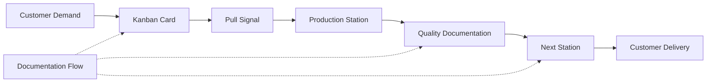
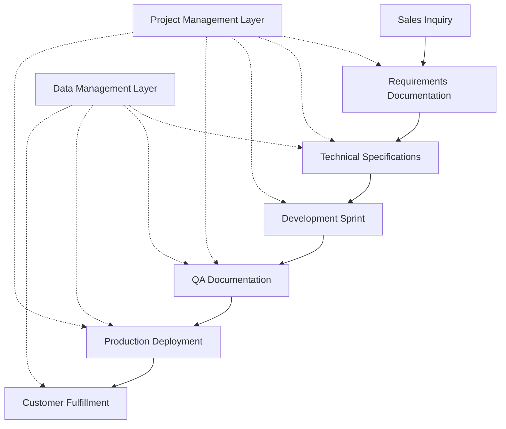
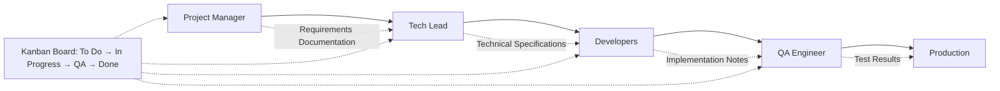
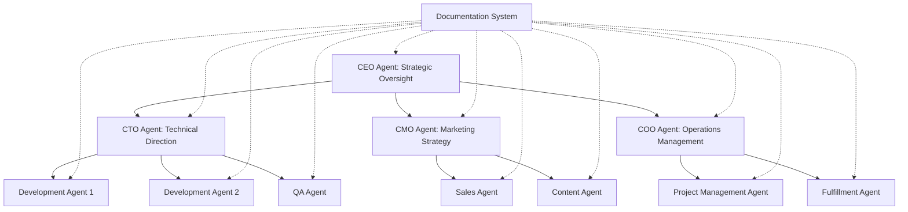

# Documentation: The Strategic Bridge Between Sales and Fulfillment

In modern business, **all value streams reduce to two fundamental activities: sales and fulfillment**. Documentation serves as the critical bridge that transforms sales promises into fulfillment reality, carrying information forward through every stage of the value creation process.

## The Evolution from Manufacturing to Knowledge Work

### Toyota's Revolutionary Insight (1940s-1970s)

The documentation revolution in business operations began with Toyota's development of the kanban system in the late 1940s. Taiichi Ohno recognized that **information flow was as critical as material flow** in manufacturing efficiency.

The kanban card wasn't just a production signal—it was a **documentation artifact** that carried essential information:
- What to produce
- When to produce it
- Quality specifications
- Downstream dependencies

### From Factory Floor to Software Development

By 2003, the Poppendiecks translated Toyota's lean principles into software development, recognizing that **code is documentation** and **documentation is inventory**. The DevOps movement further evolved these concepts, creating documentation practices that support:

- **Continuous Integration/Continuous Deployment (CI/CD)**
- **Infrastructure as Code (IaC)**
- **Automated Testing Documentation**
- **Incident Response Playbooks**

## The Modern Documentation-Driven Enterprise

### Documentation as Data Management Foundation

In today's data-driven business environment, documentation and data management practices naturally coalesce with project management practices. This convergence is critical because:

1. **Most business software is about tracking and using data for customer needs**
2. **Data models must be presented through useful interfaces**
3. **Documentation captures both the "what" and the "why" of data relationships**

### The Platform Bridge: Why Monday.com Works

Monday.com succeeds as a business platform because it bridges the potentially large gap between **data modeling complexity** and **internal end-user simplicity**. It provides:

- **Visual workflow management** (inherited from kanban)
- **Contextual documentation** (linked to specific work items)
- **Status progression tracking** (sales → development → QA → fulfillment)
- **Cross-functional visibility** (connecting diverse team roles)

## Modern Team Structure and Documentation Flow

### The 8-Person Software Team Dynamic

In a typical software team structure, documentation flows through predictable patterns:

### Kanban Status Evolution in Knowledge Work

The kanban methodology that originated at Toyota has evolved into sophisticated status tracking systems:

**Manufacturing Kanban (1940s)**
- Inventory Signal
- Production Signal
- Quality Gate

**Software Development Kanban (2000s)**
- Backlog
- To Do
- In Progress
- Code Review
- QA
- Done

**AI-Enhanced Operations (2020s)**
- Intent Capture
- Agent Assignment
- Processing
- Quality Validation
- Integration
- Fulfillment

## AI Agencies and Documentation Systems

### Organizing AI Agents Like a Modern Corporation

The future of business operations involves **AI agent networks** that mirror corporate organizational structures. Each agent requires specific documentation to function effectively:

### Documentation in AI-Driven Manufacturing Operations

Modern manufacturing operations require documentation systems that support both human workers and AI agents:

**Sales Phase Documentation:**
- Customer requirements capture
- Product specifications
- Pricing structures
- Delivery timelines

**Development Phase Documentation:**
- Formulation records
- Testing protocols
- Ingredient sourcing
- Batch tracking

**Production Phase Documentation:**
- Manufacturing procedures
- Quality control checkpoints
- Inventory management
- Shipment tracking

**Fulfillment Phase Documentation:**
- Customer delivery confirmation
- Usage instructions
- Support procedures
- Feedback collection

## The Documentation-First Organization

### Principles for Modern Documentation Systems

1. **Documentation Starts with Sales and Grows in Fulfillment**
   - Every customer interaction creates documentation artifacts
   - Requirements evolve through the fulfillment process
   - Post-fulfillment documentation informs future sales

2. **Data Management and Project Management Converge**
   - Documentation artifacts become project milestones
   - Project status drives documentation requirements
   - Data models inform project structure

3. **Visual Workflow Management Enables Cross-Functional Collaboration**
   - Kanban boards make work visible
   - Status transitions trigger documentation updates
   - Dependencies become explicit through documentation

4. **AI Agents Require Structured Documentation to Function Effectively**
   - Context-aware documentation enables intelligent automation
   - Standardized formats support agent interoperability
   - Version control enables iterative improvement

### Measuring Documentation Effectiveness

**Leading Indicators:**
- Documentation creation rate
- Cross-functional documentation access
- Documentation update frequency

**Lagging Indicators:**
- Sales-to-fulfillment cycle time
- Customer satisfaction scores
- Error rates in production

## Conclusion: Documentation as Competitive Advantage

Organizations that treat documentation as a strategic capability—not just a compliance requirement—gain significant competitive advantages:

- **Faster Sales Cycles:** Clear specifications reduce back-and-forth
- **Higher Quality Delivery:** Documented processes reduce errors
- **Scalable Operations:** Well-documented systems enable growth
- **Effective AI Integration:** Structured documentation enables automation

The evolution from Toyota's kanban cards to modern AI-driven documentation systems represents a continuous thread: **information flow optimization drives operational excellence**. Organizations that master this principle will dominate their markets in the AI age.

---

*This framework has been successfully implemented across manufacturing operations, software development teams, and AI agent networks, consistently delivering improved efficiency and reduced operational overhead.*