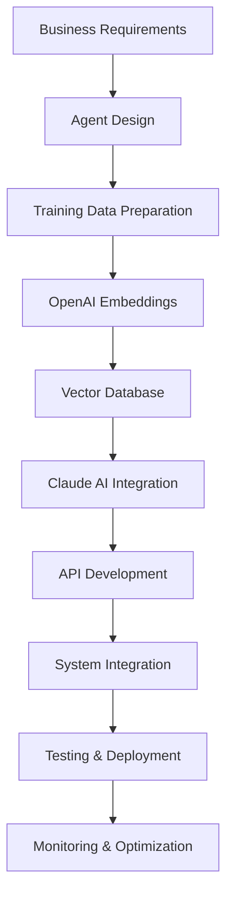

# AI Agent Development Services

## Custom Intelligent Agents for Business Automation

Transform your business operations with purpose-built AI agents that handle complex tasks, provide expert guidance, and integrate seamlessly with your existing systems.

## Service Overview

**Custom AI Agent Creation**
- Specialized agents trained on your business processes and domain knowledge
- Integration with Claude AI, OpenAI embeddings, and custom LLM solutions
- Real-time processing capabilities with vector search and retrieval systems

**Multi-Expert Agent Networks**
- Coordinated agent ecosystems for complex operational workflows
- Cross-functional agent communication and task delegation
- Centralized oversight with distributed specialized capabilities

**Business Process Automation**
- Intelligent task routing and automated decision-making
- Custom workflow integration with existing business systems
- Performance monitoring and continuous improvement protocols

## Technical Implementation

## Featured Implementations

### Expert Knowledge Agents
**WSL Expert Agent**
- Comprehensive Windows Subsystem for Linux troubleshooting
- Real-time documentation search and solution recommendations
- Integration with development workflows and CI/CD pipelines

**Quartz Documentation Agent**
- Static site generation expertise and configuration management
- Content organization and navigation optimization
- Plugin development and customization guidance

**Tailscale Network Agent**  
- VPN configuration and network troubleshooting automation
- Security policy implementation and monitoring
- Multi-platform deployment coordination

### Business Operations Agents
**Vendor Outreach Automation**
- Intelligent supplier communication and relationship management
- Automated pricing negotiations and contract management
- Supply chain optimization and timeline coordination

**Quality Assurance Oversight**
- Automated testing protocol execution and validation
- Compliance monitoring and regulatory requirement tracking
- Performance metrics analysis and reporting automation

## Integration Capabilities

**Monday.com Workflow Integration**
- Automated task creation and status updates
- Custom board management and data synchronization
- Webhook-driven agent activation and response systems

**Inflow Inventory Management**
- Real-time stock level monitoring and automated reordering
- SKU validation and product data management
- Supply chain visibility and demand forecasting

**Shopify E-commerce Automation**
- Product catalog management and pricing optimization  
- Customer service automation and order processing
- Inventory synchronization across multiple sales channels

## Delivery Process

1. **Discovery & Requirements Analysis** - Understanding your business processes and automation needs
2. **Agent Architecture Design** - Creating the technical blueprint and integration strategy
3. **Training Data Preparation** - Curating and processing domain-specific knowledge bases
4. **Development & Training** - Building and fine-tuning specialized AI agents
5. **Integration & Testing** - Connecting agents to your systems with comprehensive validation
6. **Deployment & Monitoring** - Live implementation with performance tracking and optimization

## Investment & Timeline

**Proof of Concept**: 1-2 weeks
- Single-purpose agent demonstration
- Basic integration with existing systems
- Performance metrics and ROI analysis

**Full Implementation**: 4-8 weeks
- Complete multi-agent network deployment
- Comprehensive system integration
- Training and documentation delivery

**Ongoing Support**: Monthly retainer
- Performance monitoring and optimization
- Agent training updates and capability expansion
- Technical support and system maintenance

---

## Ready to Automate Your Operations?

**Schedule a consultation** to discuss your specific automation needs and receive a custom proof of concept demonstration.

[[contact/Consultation Process|Request a Consultation →]]

*Specializing in Claude AI development, OpenAI embeddings, custom agent training, business process automation, and enterprise system integration.*