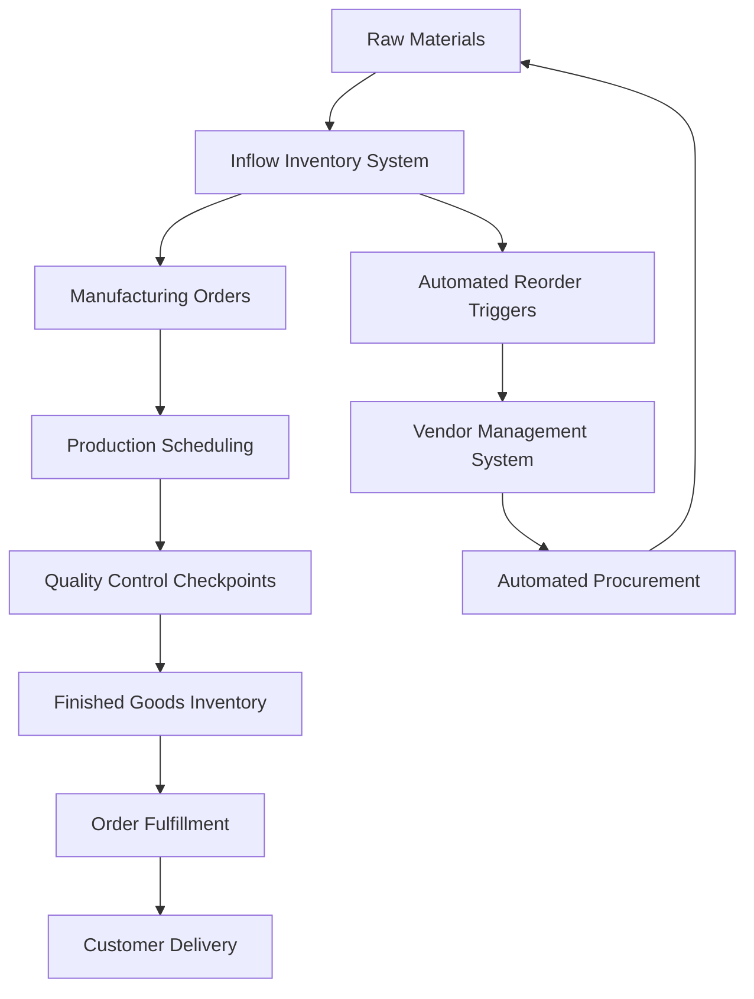
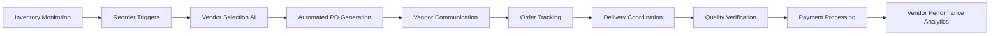

# Manufacturing Operations Optimization
## Comprehensive Systems Integration for Modern Manufacturing

Transform your manufacturing operations through intelligent automation, integrated workflow management, and scalable system architecture. Specializing in cosmetics manufacturing, inventory management, vendor coordination, and quality assurance protocols.

## Service Overview

**Complete Manufacturing Ecosystem Integration**
- Inflow inventory management system optimization and automation
- Monday.com workflow coordination and team collaboration
- Vendor relationship management and automated procurement
- Quality control protocols and compliance monitoring
- Sales integration and order fulfillment optimization

**DevOps Methodology Application**
- Agile manufacturing processes with continuous improvement
- Automated testing and quality assurance integration
- Performance monitoring and analytics implementation
- Scalable infrastructure design for growth accommodation

## Core Service Areas

### Inflow Inventory Management Transformation

**Advanced Inventory Optimization**
- Real-time stock level monitoring and automated reorder protocols
- SKU management and product catalog organization
- Manufacturing order coordination and batch tracking systems
- Custom field implementation for specialized business requirements

**Integration Capabilities**
- API development for third-party system connections
- Data synchronization across multiple platforms
- Automated reporting and analytics dashboard creation
- Mobile access and field operation optimization

**Technical Implementation**

### Monday.com Workflow Automation

**Enterprise Workflow Design**
- Custom board development for manufacturing-specific processes
- Automated task routing and status management
- Cross-departmental collaboration and communication protocols
- Performance tracking and KPI dashboard implementation

**Team Training & Adoption**
- Comprehensive onboarding programs for new system adoption
- Best practices development and documentation
- Change management support for organizational transformation
- Ongoing optimization and process improvement facilitation

**Manufacturing-Specific Workflows**
- Production planning and scheduling automation
- Quality control and compliance tracking
- Vendor management and procurement coordination
- Sales order processing and customer communication

### Vendor Management & Procurement Automation

**Intelligent Vendor Coordination**
- Automated vendor outreach and communication systems
- Performance tracking and evaluation protocols
- Contract management and renewal automation
- Supply chain visibility and risk management

**Procurement Process Optimization**
- Automated purchase order generation and approval workflows
- Price comparison and vendor selection optimization
- Delivery tracking and inventory coordination
- Payment processing and vendor relationship management

**Technical Architecture**

## Quality Assurance & Compliance

### Manufacturing Quality Control

**Automated Quality Protocols**
- Real-time quality monitoring and testing coordination
- Batch tracking and traceability system implementation
- Compliance documentation and audit trail maintenance
- Non-conformance detection and corrective action protocols

**Regulatory Compliance Management**
- FDA and industry-specific regulation adherence
- Documentation standardization and maintenance
- Audit preparation and regulatory reporting automation
- Quality management system (QMS) integration

### Process Standardization

**Standard Operating Procedure (SOP) Development**
- Manufacturing process documentation and optimization
- Quality control checkpoint establishment
- Training protocol development and implementation
- Continuous improvement process integration

**Performance Measurement & Analytics**
- Key performance indicator (KPI) identification and tracking
- Real-time dashboard development and monitoring
- Trend analysis and predictive maintenance protocols
- Cost optimization and efficiency improvement recommendations

## Sales Integration & Customer Management

### Order Processing Automation

**Streamlined Order Fulfillment**
- Automated order routing from sales to production
- Inventory availability checking and allocation
- Production scheduling and capacity planning
- Customer communication and delivery coordination

**Customer Relationship Management**
- Integrated CRM and manufacturing system coordination
- Customer order history and preference tracking
- Automated communication and status update protocols
- Customer satisfaction monitoring and feedback integration

### Revenue Optimization

**Pricing Strategy Implementation**
- Cost calculation automation and pricing optimization
- Profit margin tracking and analysis
- Market demand forecasting and inventory planning
- Sales performance analytics and trend identification

## Implementation Methodology

### Phase 1: Assessment & Planning (Week 1-2)
**Current State Analysis**
- Existing system audit and capability assessment
- Process mapping and inefficiency identification
- Stakeholder requirement gathering and prioritization
- Technical architecture design and integration planning

### Phase 2: Core System Implementation (Week 3-6)
**Foundation Development**
- Inflow system optimization and custom configuration
- Monday.com workflow design and implementation
- Basic automation protocol establishment
- Initial team training and onboarding

### Phase 3: Advanced Integration (Week 7-10)
**Automation Enhancement**
- API development and system integration
- Advanced workflow automation implementation
- Quality control protocol integration
- Performance monitoring and analytics deployment

### Phase 4: Optimization & Training (Week 11-12)
**Performance Optimization**
- System performance tuning and optimization
- Comprehensive team training and certification
- Process refinement and improvement implementation
- Documentation completion and knowledge transfer

## Ongoing Support & Optimization

**Continuous Improvement Program**
- Monthly performance review and optimization recommendations
- System updates and feature enhancement implementation
- Team training and capability development
- Strategic planning and growth accommodation

**Technical Support & Maintenance**
- 24/7 system monitoring and incident response
- Regular backup and disaster recovery testing
- Security protocol maintenance and compliance
- Performance optimization and capacity planning

---

## Investment & Timeline

**Proof of Concept**: 2-3 weeks
- Single process automation demonstration
- Basic system integration and functionality testing
- Initial ROI analysis and performance measurement

**Full Implementation**: 8-12 weeks
- Complete manufacturing ecosystem integration
- Comprehensive team training and change management
- Advanced automation and optimization deployment

**Ongoing Partnership**: Monthly retainer
- Continuous optimization and improvement
- Technical support and system maintenance
- Strategic planning and growth accommodation

## Ready to Transform Your Manufacturing Operations?

Schedule a consultation to discuss your specific manufacturing challenges and receive a customized automation strategy and implementation plan.

[[contact/Consultation Process|Request a Manufacturing Assessment →]]

*Specializing in Inflow inventory management, Monday.com workflow automation, manufacturing process optimization, vendor management systems, quality control automation, and DevOps methodology application in manufacturing environments.*